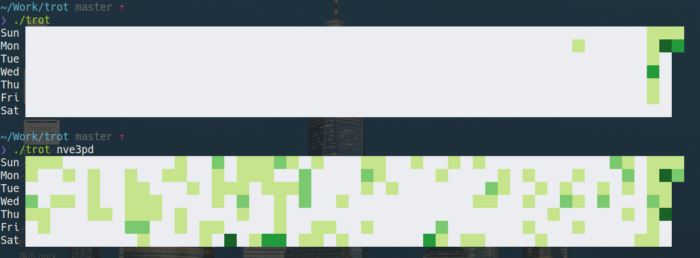

=====
trot
=====

.. image:: https://travis-ci.com/nve3pd/trot.svg?branch=master
    :target: https://travis-ci.com/nve3pd/trot

trot is a CLI Application that expresses grass of GitHub at terminal.

requires
-----------
::

  nim >= 0.18.0
  Terminal supporting True Color

build
-----
::

  $ nimble build

install
-------
::

  $ git clone https://github.com/nve3pd/trot
  $ cd trot
  $ nimble install

usage
-----
::

    trot is a CLI Application that expresses grass of GitHub at terminal.
    Usage: trot [OPTION] [username]
           trot -h | --help
           trot -v | --version
    Option:
      -h --help      show this screen.
      -v --version   show version.

::

  # show repository contributions
  $ trot
  # show nve3pd's contributions
  $ trot nve3pd

author
------
taichi uchihara (@u_chi_ha_ra_)

license
-------
MIT
